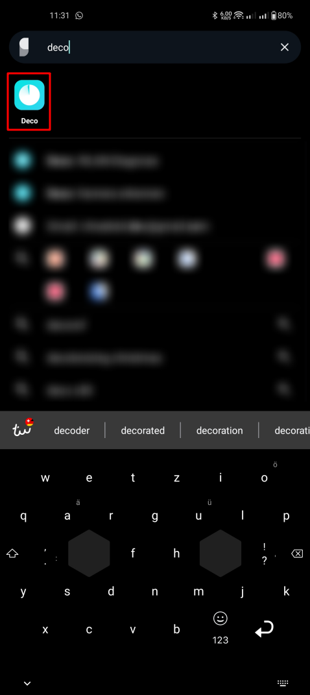
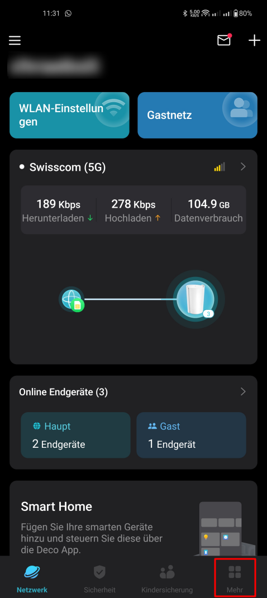
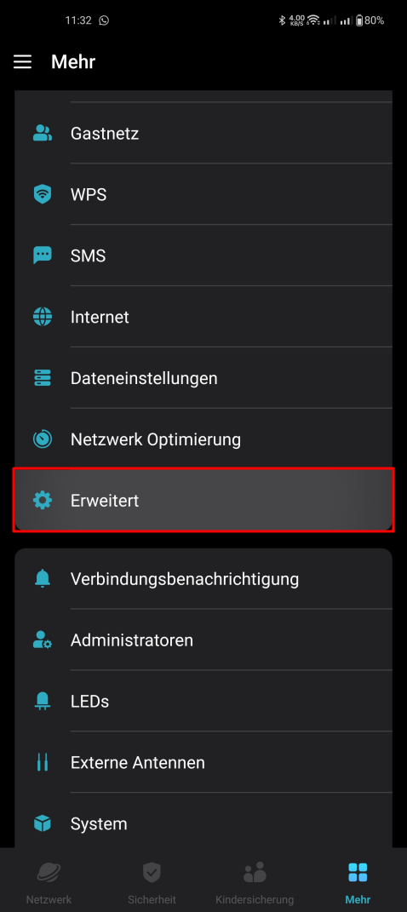
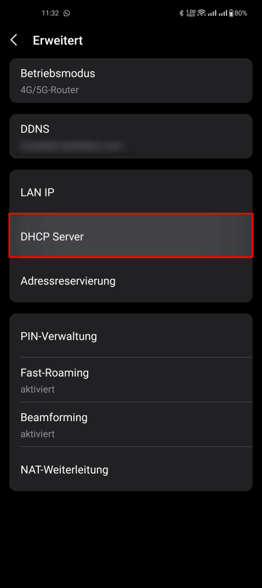
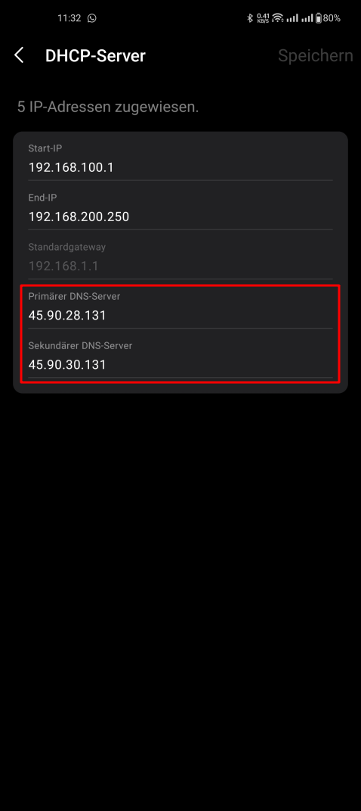
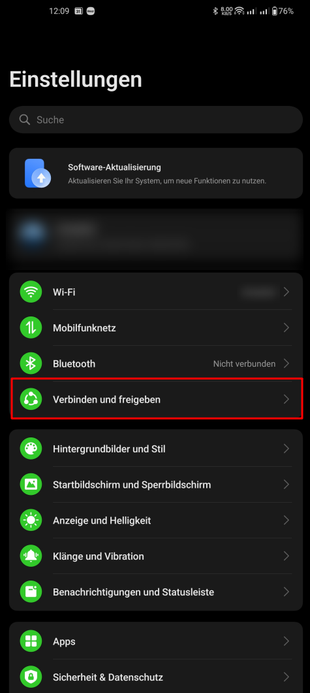
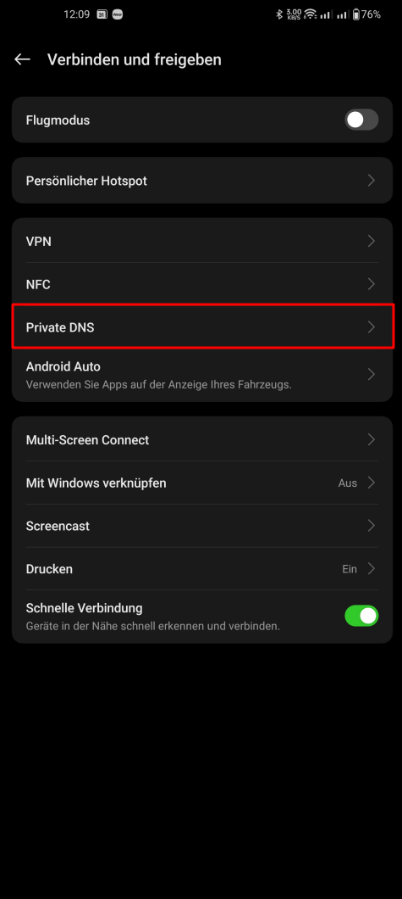
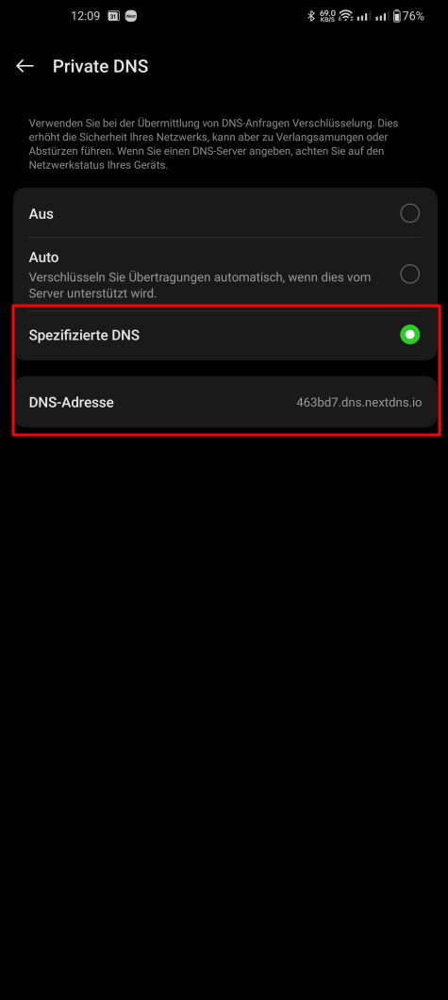

!!! Lerne, wie du Werbung und Tracker auf deinen Geräten entfernen kannst, um deine Privatsphäre zu schützen und ein besseres Nutzererlebnis zu erzielen.

===

## Warum Werbung und Tracker entfernen?
Werbung und Tracker sind allgegenwärtig im Internet und auf vielen Geräten. Sie sammeln Daten über dein Verhalten, um personalisierte Werbung anzuzeigen oder dein Online-Verhalten zu analysieren. Dies kann deine Privatsphäre beeinträchtigen und zu einem schlechteren Nutzererlebnis führen. Indem du Werbung und Tracker entfernst, kannst du deine Daten schützen und ein schnelleres, saubereres Surferlebnis geniessen.

## Methoden zur Entfernung von Werbung und Trackern
Es gibt verschiedene Methoden, um Werbung und Tracker zu entfernen. Nicht alle sind gleich effektiv oder einfach zu implementieren. Die Mischung aus mehreren Methoden bietet oft den besten Schutz und die beste Nutzererfahrung.

Hier sind einige der effektivsten Methoden, die wir empfehlen und selbst verwenden:
1. **Next-Gen Firewall**: Eine Next Generation Firewall überwacht und kontrolliert den ein- und ausgehenden Netzwerkverkehr basierend auf vordefinierten Sicherheitsregeln. Diese ist meist nur in Firmennetzwerken zu finden und weniger für den Heimgebrauch geeignet.
2. **DNS Filter verwenden**: Ein DNS Filter wie NextDNS kann Werbung und Tracker auf Netzwerkebene blockieren. Dies bedeutet, dass alle Geräte in deinem Netzwerk von diesem Schutz profitieren, ohne dass du auf jedem Gerät einzelne Einstellungen vornehmen musst.
3. **spezieller Browser**: Verwende einen datenschutzorientierten Browser wie Brave, der integrierte Werbe- und Tracker-Blocker bietet. Dies verbessert dein Surferlebnis erheblich.
4. **Browser-Erweiterungen**: Ergänze deinen Browser mit Erweiterungen wie uBlock Origin, um zusätzliche Schutzebenen gegen Werbung und Tracker hinzuzufügen.

## DNS Filter über Firewall einrichten
Wenn du eine professionelle Firewall (zum Beispiel [FortiGate](https://www.fortinet.com/products/next-generation-firewall)) verwendest, kannst du dort DNS Filter Regeln einrichten, um Werbung und Tracker zu blockieren. Die genaue Vorgehensweise hängt von der verwendeten Firewall ab, aber im Allgemeinen musst du eine Regel erstellen, der definierte Hostnamen blockiert. Dafür kannst du öffentliche Blocklisten verwenden, die auch NextDNS nutzt. Zudem kannst du auch dort die DNS Server Adressen von NextDNS eintragen, um den gesamten DNS Verkehr über NextDNS zu leiten.

## DNS Filter mit NextDNS einrichten
### Wie funktioniert ein DNS Filter?
Ein DNS Filter funktioniert folgendermassen: Wenn du eine Webseite besuchst, fragt dein Gerät einen DNS Server nach der IP Adresse der Webseite. Dieser gibt dann die IP Adresse zurück, damit dein Gerät eine Verbindung herstellen kann. Ein DNS Filter überprüft diese Anfragen und blockiert diejenigen, die zu bekannten Werbe- oder Tracker Domains führen. So kann gar nicht erst die Verbindung zu diesen unerwünschten Inhalten hergestellt werden, was zu einem schnelleren und sichereren Surferlebnis führt.

### Wo stelle ich den DNS Filter ein?
Der DNS Server kann auf dem Gerät selbst in den Netzwerkeinstellungen oder auch auf dem Router für alle Geräte im Netzwerk eingestellt sein. So kann man in einem fremden WLAN beispielsweise den DNS Filter auf dem Gerät selbst einstellen, während man zu Hause den DNS Filter auf dem Router einstellt, damit alle Geräte im Netzwerk davon profitieren.

### NextDNS Einrichtung
[NextDNS](https://nextdns.io/) ist ein beliebter DNS Filter Dienst, der einfach einzurichten und zu verwenden ist. NextDNS bietet ein kostenloses Abo mit einer begrenzten Anzahl von Anfragen pro Monat, was für die meisten Nutzer ausreichend ist. Für diejenigen, die mehr Anfragen benötigen oder zusätzliche Funktionen wünschen, gibt es kostenpflichtige Abonnements für nur 20 CHF pro Jahr.

Eine Alternative zu NextDNS ist [AdGuard DNS](https://adguard-dns.io/).

NextDNS bietet eine Vielzahl von Filterlisten, die du aktivieren kannst, um Werbung und Tracker zu blockieren. Du kannst auch benutzerdefinierte Filterlisten hinzufügen, um spezifische Domains zu blockieren oder zuzulassen. Zudem gibt es detaillierte Statistiken über die blockierten Anfragen, sodass du sehen kannst, wie effektiv dein Schutz ist und viele weitere nützliche Funktionen.

Um NextDNS einzurichten, folge diesen Schritten:
1. Erstelle ein Konto auf der [NextDNS Registrierungsseite](https://my.nextdns.io/signup)
2. Erstelle eine neue Konfiguration und nenne sie beispielsweise "Zuhause" oder "Mobil"
3. Stelle nun die Konfiguration nach Belieben ein:
   1. **Tab Installation**: Hier findest du die Anweisungen zur Einrichtung auf verschiedenen Geräten und Plattformen. Wähle diejenige aus, die du verwenden möchtest, und folge den Anweisungen. Weiter unten findest du ein paar Beispiele von uns.
   2. **Tab Sicherheit**: Aktiviere oder deaktiviere die gewünschten Funktionen. Wir empfehlen die voreingestellten Optionen zu belassen, da diese bereits einen guten Schutz bieten.
   3. **Tab Datenschutz**: Aktiviere die gewünschten Datenschutzfunktionen. Wir nutzen folgende Blocklisten: "NextDNS Anzeigen & Tracker Blockliste", "AdGuard DNS filter", "OISD", "AdGuard Mobile Ads filter", "EasyList". Füge den nativen Geräteschutz anhand deiner Geräte hinzu. Erlaube Affiliate Links, falls du die Funktion benötigst.
   4. **Tab Jugendschutz**: Stelle ein, welche Apps und Kategorien du blockieren möchtest. Die Option "Bypass Methode blockieren" ist nützlich, um zu verhindern, dass Nutzer versuchen, den Jugendschutz zu umgehen, zB mit VPNs. Meist ist es jedoch sinnvoll, diese Option deaktiviert zu lassen, da sie sonst zu viele Probleme verursachen kann, wenn legitime VPNs verwendet werden.
   5. **Tab Denyliste**: Füge hier Domains hinzu, die du manuell blockieren möchtest, die nicht bereits durch die Filterlisten abgedeckt sind.
   6. **Tab Allowliste**: Füge hier Domains hinzu, die du manuell zulassen möchtest, falls sie fälschlicherweise blockiert werden.
   7. **Tab Statistiken**: Hier kannst du die Statistiken über die blockierten Anfragen einsehen, um zu sehen, wie effektiv dein Schutz ist. Schaue dir diese Seite regelmässig an, um einen Überblick über die blockierten Anfragen zu erhalten und um sicherzustellen, dass dein Schutz optimal funktioniert.
   8. **Tab Protokolle**: Hier findest du detaillierte Protokolle über die Anfragen, die von deinem Gerät gesendet wurden. Dies kann nützlich sein, um zu sehen, welche Domains blockiert wurden und warum.
   9. **Tab Einstellungen**: Hier kannst du allgemeine Einstellungen für deine Konfiguration vornehmen. Prüfe, dass Protokolle gespeichert werden, um detaillierte Informationen über blockierte Anfragen zu erhalten. Ändere die Speicherung der Protokolle nach deinen Bedürfnissen. Aktiviere die Blockseiten, um benutzerfreundliche Seiten anzuzeigen, wenn eine Domain blockiert wird. Andernfalls kann es zu Unklarheiten kommen, wenn eine Seite nicht geladen wird. Zudem kannst du hier weitere Nutzer zu deiner Konfiguration hinzufügen, die Schreib oder Leserechte erhalten.

!!!! Folge nun den Anweisungen auf der Installationsseite, um NextDNS auf deinen gewünschten Geräten einzurichten. Du findest in den nächsten Abschnitten einige Beispiele. Nutze hierbei die Endpunkte auf deiner Installationsseite:
!!!! 

### NextDNS auf Router Ebene einrichten
Die Einrichtung von NextDNS auf Router Ebene stellt sicher, dass alle Geräte in deinem Netzwerk von dem Schutz profitieren, ohne dass du auf jedem Gerät einzelne Einstellungen vornehmen musst. Die genaue Vorgehensweise hängt vom Router Modell ab, aber im Allgemeinen musst du die DNS Einstellungen in der Router Konfiguration ändern.

#### Swisscom Router
Wir zeigen in diesem Abschnitt die Einrichtung auf einem Swisscom Router:
1. Melde dich bei der Weboberfläche deines Routers an (normalerweise über [192.168.1.1](http://192.168.1.1/)). Die Zugangsdaten findest du oft auf der Rückseite des Routers.
   - Falls `192.168.1.1` nicht funktioniert, suche in den Netzwerkeinstellungen deines Computers oder Handys nach der Standardgateway-Adresse, um die richtige IP Adresse für deinen Router zu finden.
2. Aktiviere den Expertenmodus, um Zugriff auf erweiterte Einstellungen zu erhalten. 
3. Navigiere zu "Netzwerk > Einstellungen > IP Einstellungen" und scrolle zu DNS Server. 
   1. Wähle die Option "Manuell" aus, um benutzerdefinierte DNS Server Adressen einzugeben.
   2. Gib die DNS Server Adressen aus deiner NextDNS Konfiguration ein
   3. Lasse die Option "DNS Cache der Internetbox" aktiviert, damit die DNS Anfragen zwischengespeichert werden und dein Surferlebnis schneller wird.
   4. Speichere die Einstellungen und lösche den DNS Cache auf dem Router, damit die neuen DNS Server Adressen sofort verwendet werden.

!!!! Neue DNS Anfragen werden nun über NextDNS geleitet und Werbung sowie Tracker werden blockiert, solange deine Geräte mit dem Router verbunden sind und die DNS Server Adressen nicht manuell überschrieben wurden zB durch die Netzwerkeinstellungen auf den Geräten.

#### TP Link Router
Wir zeigen in diesem Abschnitt die Einrichtung auf einem TP Link mobile Router:
1. Öffne die Deco App auf dem Handy, während du mit dem Deco Netzwerk verbunden bist.
2. Navigiere in der Navigation zu "Mehr"
3. Klicke auf "Erweitert Einstellungen"
4. Klicke auf "DHCP Server"
5. Gib die DNS Server Adressen aus deiner Konfiguration ein
6. Klicke auf der NextDNS Seite auf "verknüpfe IP"

[gallery rowHeight=300]

[/gallery]

!!!! Die DNS Abfragen werden nun über NextDNS geleitet und Werbung sowie Tracker werden blockiert, solange dein Gerät mit dem Deco Netzwerk verbunden ist und die DNS Server Adressen nicht manuell überschrieben wurden zB durch die Netzwerkeinstellungen auf den Geräten.

### NextDNS auf Android Smartphone einrichten
Um NextDNS auf einem Android Smartphone einzurichten, folge diesen Schritten:
1. Öffne die "Einstellungen" App auf deinem Android Gerät.
2. Gehe zu "Verbinden und Freigeben" oder "Netzwerk & Internet", je nach Android Version.
3. Navigiere zu "Private DNS".
4. Wähle die Option "Spezifizierte DNS und gib bei DNS Adresse die DNS-over-TLS/QUIC Adresse aus deiner NextDNS Konfiguration ein (zB "abc123.dns.nextdns.io").

[gallery rowHeight=300]

[/gallery]

## Browser für besseres Surfen verwenden
Neben der Verwendung eines DNS Filters wie NextDNS, kann auch die Nutzung eines datenschutzorientierten Browsers wie [Brave](https://brave.com/), [LibreWolf](https://librewolf.net) oder [Zen Browser](https://zen-browser.app) dein Surferlebnis erheblich verbessern. Brave blockiert standardmässig Werbung und Tracker (sollte diese trotz DNS Filter nicht bereits blockiert worden sein), was zu einem schnelleren und saubereren Surfen führt. Zudem bietet Brave zusätzliche Datenschutzfunktionen wie integriertes HTTPS Everywhere und Schutz vor Fingerprinting.

## Browser Erweiterungen verwenden
In Brave und LibreWolf sind bereits integrierte Werbe- und Tracker Blocker enthalten. Wenn du jedoch einen anderen Browser nutzt, kannst du Browsererweiterungen wie [uBlock Origin](https://ublockorigin.com/) installieren, um zusätzliche Schutzebenen gegen Werbung und Tracker hinzuzufügen. uBlock Origin ist eine leistungsstarke und anpassbare Erweiterung, die eine Vielzahl von Filterlisten unterstützt und es dir ermöglicht, spezifische Domains zu blockieren oder zuzulassen.
